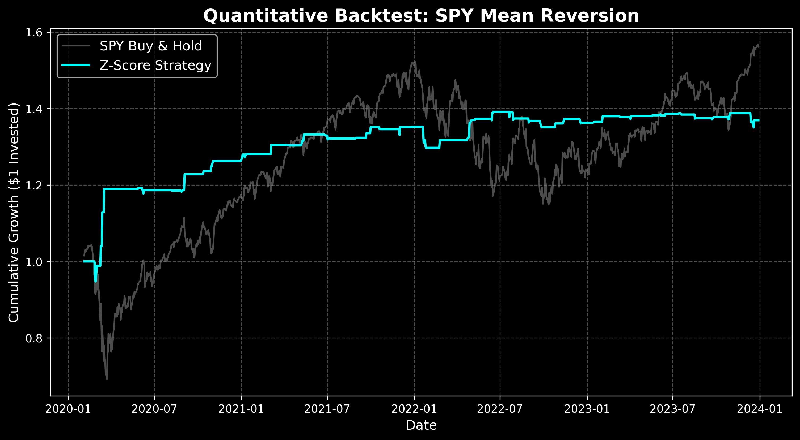

# Quantitative Backtesting Engine

A high-performance, vectorized financial backtesting framework built in Python. Designed to ingest market data, generate statistical alpha signals, and evaluate risk-adjusted returns (Sharpe Ratio, Volatility).

## System Architecture
* **Data Ingestion:** Automated pipeline using `yfinance` to pull adjusted daily OHLCV data.
* **Analytics Engine:** Pure vectorized Pandas and NumPy operations (zero `for` loops) for C-level execution speed.
* **Strategy Execution:** Modular logic supporting dynamic statistical algorithms. Currently running a Z-Score Mean Reversion strategy.
* **Performance Visualization:** Automated generation of professional-grade equity curve tearsheets using Matplotlib.

## Live Strategy Performance: SPY Mean Reversion (2020-2024)
The current implementation utilizes a 20-day Simple Moving Average (SMA) and a 2.0 Standard Deviation Z-Score threshold. The strategy prioritizes risk-adjusted returns (Sharpe Ratio) over absolute returns, sitting in cash during highly volatile, non-statistically significant market regimes.



*Notice the strategy (Cyan) avoiding the catastrophic market drawdowns of 2020 and 2022 by maintaining strict mathematical entry/exit thresholds.*

## Tech Stack
* **Language:** Python 3
* **Data Manipulation:** Pandas, NumPy
* **Visualization:** Matplotlib

## Execution
To run the engine locally and generate a new performance tearsheet:
```bash
python backtest-engine/main.py
```